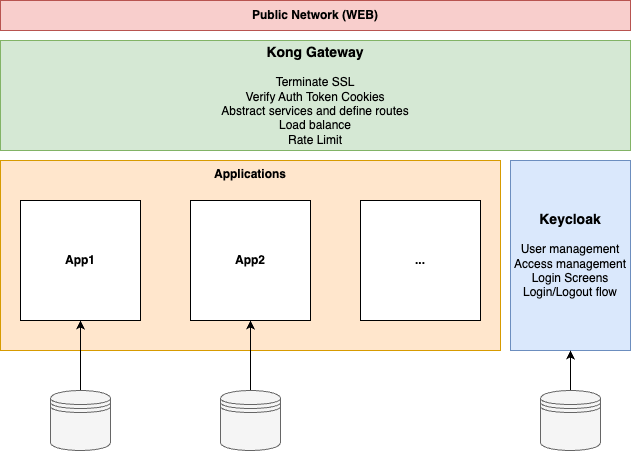

# extension-infra

This setup provides a live experimental environment where various applications
developed with different tools, platforms, languages, frameworks, etc. could be easily
deployed in a secure environment. More importantly, an environment providing out-of-the-box
authentication and authorization flows.

<center>
    
</center>

## Components

### Kong Gateway
https://konghq.com/

Open source API gateway providing strong request routing, load balancing, and upstream
management features. The gateway can be enhanced via a plugin system which this project
utilizes to achieve such features as Oauth2.0 flows with OIDC, rate limiting, etc. 

This project strictly utilizes free version of Kong Gateway, as well as its plugins. 
There had been some adjustments for this to be true. For example, custom container layers
introducing the open oidc connect plugin.

### Keycloak

Implementing and maintaining secure authentication in applications usually takes a good
chunk of app development. This is the reason this project decided to outsource this work
to Keycloak. This is a proven platform implementing the best practices in a robust and 
easy to use way. 

One important reason we chose Keycloak is that it takes care of user management dashboards
and login screens. 

### Keycloak & Gong

To be completed

## Development

This section contains instructions on setting up a local environment for experimentation
and development.

### Prerequisites

Locally, you will need the following tools to startup this setup and test/develop:

- Unix based host system (linux, macos)
- SSL Certificate generator / manager for Kong
- Docker & docker-compose
- Python & packages installed
    - After installing Python run `pip install -r requirements.txt`

### Quickstart

Run the following invoke command to configure and start the containers on a 
local dev environment

```bash
invoke dev
```

This will generate configs, automate the configuration, ssl certs, image builds and container startup for you.
The default behavior will assume the local DNS name, ports, certificates, etc. 
Assumptions can be seen in `.env` file after invoke has run, or in `devops/config/dev.env`
prior to the first run. 

Note you may still need to take actions after this. Look out for these:

- Install the local CA `mkcert -install` (may require root access)

### 1. Configuration

The difference between a development and production environment is in the 
`.env` file in the root of this repository. If it's missing, create one. 

To see the list of configurations and their defaults refer to `devops/dev.env` file.

### 2. Certificates

Kong API gateway is configured to always use SSL. A development (or non-secure)
option is not implemented in this repository. 

For a development machine where everything is running locally, you will need
to setup a complete chain according to IP and DNS protocols. The following 
should serve as a guide:

1. Select a DNS name for your local deployment `ex. domain.local.my`
1. Generate a self-signed certificate and a private key for this name
    - Use MacOS keychain or ssl tools on linux
1. Register the self signed keychain on your local machine as trusted keys
1. Modify the `Kong SSL Certificates` section of the environment file
1. Add the domain name to your hosts file to point to the ip:port of your
 deployment (in `.env` file)

### Keycloak (KC)

Keycloak configuration happens mostly after the system is already up and 
running, since the configuration is done using the Keycloak admin UI. It
is very important to configure KC properly for the Kong integration to 
work as needed.

To configure Keycloak follow these steps:

- Create a new Keycloak Realm


### Restore dev realm from file
When first setting up this environment locally, for dev application   
to work correctly you will need to create the realm and update all the 
keys and endpoints. However, you can also import a realm from a file 
located at `keycloak/dev-api.json` and have everything setup for you for
testing. 

The realm will have a client `dev-api-app` and a user `test1` with password
`test1`;


## Onboarding Applications

### Setup Keycloak

1. Create a new Realm (ex. Dev API). Just the name is enough.
    Make sure the name doesn't contain spaces and other characters you
    will have pain with in CLI
1. Create a Client
    - Client Type: OpenID Connect
    - Client ID: any, this will uniquely identify your client
    - Name: any, this one is for you to detect the client among others
    - Always Display in UI: off
    - Client Authentication: On, this means that any user will be able to open a login screen
    - Authorization: On, we want the user profile and ID
    - Standard Flow: checked
    - Direct Access Grant: checked
1. Root URL: leave blank
1. Home URL: leave blank
1. Valid redirect URIs: these are specific to your application. Should include the full path
    including the protocol and domain name matching the `EXT_HOSTNAME` envvar. 
    - Ex. `https://carvantage.host.my/*` Note the wildcard. This is good for dev
        but don't do this in a real app
1. Valid post logout URIs: these should match your configuration for post-logout uri in the
    app kong.yml. See `apps/dev_api/vars.env/DEV_API_KONG_POST_LOGOUT_REDIRECT`
    - Ex `https://carvantage.host.my/*` Note the wildcard. This is good for dev
        but don't do this in a real 
1. Web Origins: `/*` for the test application (local dev), but should be set to your
    login routes and host name.
1. Generate and copy client credentials
    - Navigate to `Credentials` tab of the new client
    - Make sure Client Authenticator is set to `Client Id and Secret`
    - Generate and copy the client secret
1. Create the Discovery URL for Kong
    - auth/realms/<realm_name>/.well-known/openid-configuration
1. Create the Redirect After Logout path
    - auth/realms/<realm_name>/protocol/openid-connect/logout

